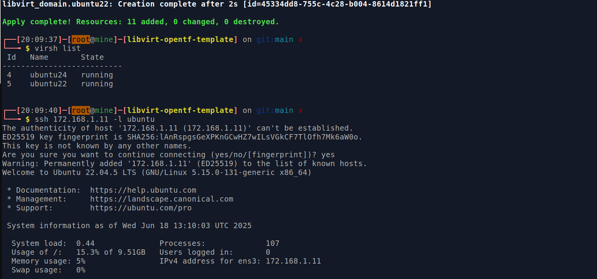

# Libvirt opentf Template

`Libvirt opentf Template` is python script to generate `main.tf` that using `libvirt` provider to provision virtual machines using defined specs in `tf-specs.yaml` file

## Tested running environment

1. Operating system: `24.04.2 LTS`
2. Qemu-kvm version: `8.2.2+ds-0ubuntu1.7`
3. Libvirtd version: `10.0.0`

## Features

Basically purpose of the script is to generate ready to use `main.tf` to provision single or multiple virtual machines with defined specs, like:
- Define hostname, username and password
- Define network name and ip address
- Define cpu and memory
- Define multiple disk with different size and pool
- Define os image

## Installation

1. Install qemu, kvm, libvirt, virt-manager and xsltproc. You can follow any tutorial in google

2. Install opentofu (prefered) or you can also use terraform

## Pre-requisite

You can create multiple qemu/kvm `pool` first or you can leave it by `default`. To create `pool` you can use `virt-manager` as GUI console, go to `Edit` -> `Connection Details` -> `Storage`. Then download cloud image, for ubuntu cloud images in i usually download from here [official repo](https://cloud-images.ubuntu.com/) then store the image to `pool` you desired.


## Usage

1. Fill the `tf-specs.yaml` file with considered virtual machines specs you want to provision. 

The file structure basically like this:

```
tf_specs:
  networks_specs:
  - name:                           # network name to create
    subnet:                         # subnet network
  vm_specs:
  - hostname:                       # vm hostname
    image:                          # image name
    image_pool:                     # image pool name
    username:                       # vm username
    password:                       # vm password
    vcpu:                           # vm cpu core
    memory:                         # vm memory in MB
    cache:                          # make sure disk performance as is pool, cache disk == none
    disks:
    - {"pool": "", "device": "", "size": }   # vm disk in GiB
    networks:                                # vm networks per interface
    - {"name": "", "ip":""}
```

2. Generate `main.tf` file

```
python3 generate.py
```

3. Init opentofu directory and provision virtual machine

```
tofu init
tofu apply -auto-approve
```

4. Check opentofu virtual machines status

```
tofu show
```

5. Ssh to virtual machines

```
ssh <virtual machine ip>
```

6. If wanna make changes, just make changes in `tf-specs.yaml` file, re-generate `main.tf` then, provision the new virtual-machines

```
edit tf-specs.yaml

python3 generate.py

tofu apply -auto-approve
```

7. Clean up

```
tofu destroy -auto-approve
```

## Result 

